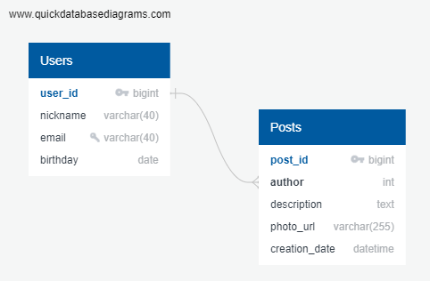

# DataBase Structure
## ER-diagram (includes user, post):



## Examples of DB quires:
###  Users

Create a new user:
```sql 
INSERT INTO users (nickname, email, birthday)
VALUES ('Roman', 'roman@gmail.com', '2005-12-23');
```
Get all users:
```sql 
SELECT * FROM users;
```
Get user by user_id:
```sql 
SELECT * FROM users WHERE user_id = 1;
```

Update user:
```sql 
UPDATE users
SET nickname = 'New_Roman', email = 'newEmail@gmail.com'
WHERE user_id = 1;
```
Delete user:
```sql 
DELETE FROM users WHERE users.user_id = 1;
```  

###  Posts
Create new post:
```sql 
INSERT INTO posts (author, text, photo_url)
VALUES ('Post', '2025-10-10 12:00:00', 'Text', 'http://example.com/photo.jpg');

```
Get all posts:
```sql 
SELECT * FROM posts;
```
Get post by post_id:
```sql 
SELECT * FROM posts WHERE posts.post_id = 1;
```
Update post:
```sql 
UPDATE posts
SET text = 'NewText'
WHERE post_id = 1;
```
Delete post:
```sql 
DELETE FROM posts WHERE posts.post_id = 1;
```
Search posts by author and creation_date:
```sql 
SELECT * FROM posts
WHERE author = 'Roman' AND creation_date >= '2025-10-10 00:00:00';
```